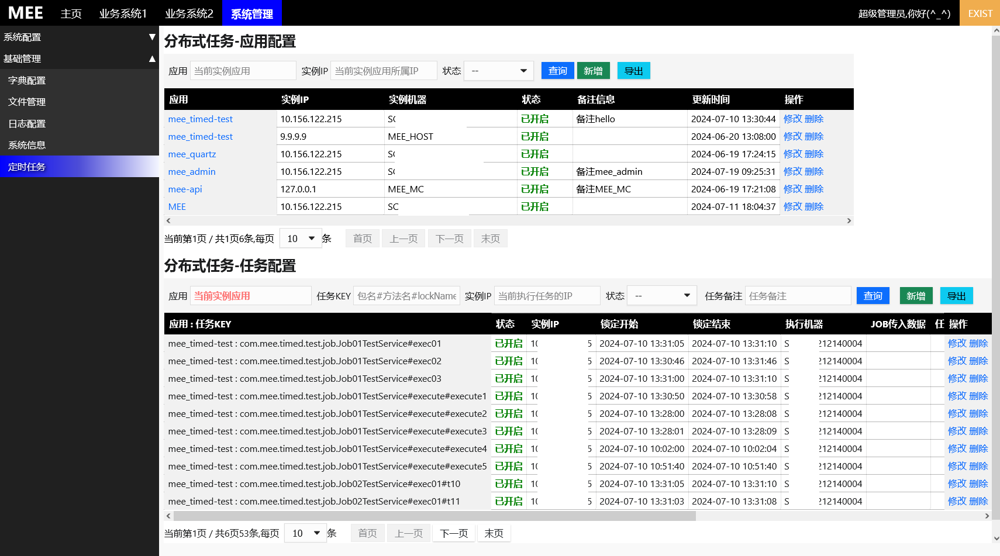
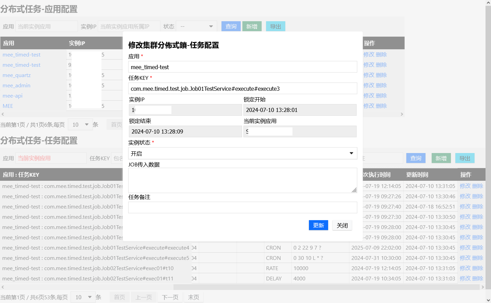

## mee_timed
 mee_timed是对 spring Scheduled + shedlock 的二开,功能二合一减少了复杂的依赖配置，使开发人员专注于定时任务类业务开发
在此特别感谢[spring官方开发团队]()以及开源[shedlock]()，没有你们的存在就不会有此项目的出现🎈
 
### 特点一：升级了升级了scheduled
mee_timed在本质上升级了cron表达式的复杂性(改为quartz的cron表达式)，使时间配置更加灵活
同时也将内部默认单线程升级为线程池，简化了内部一些不必要的逻辑
固定了相关api（支持高版本的spring而不用单独做适配）
扩展了传参的可能(base版本需接入方自行反序列化json)

### 特点二: 丰富了锁及集群节点的管理
升级了由单key(name) 锁定到 key+application的锁定支持，支持多节点
新增了app表 提供了对分布式多集群的管理，各个任务执行时只锁定各自应用/实例下的key
添加了state字段(app及job表均有)提供了对任务及实例开关的控制


### 特点三： 简化了配置
去掉了shedlock的bean配置，现在只需在配置文件中定义简单的几行即可
简化了原有@Scheduled的定义参数同时融合了@SchedulerLock注解配置 为 @MeeTimed,更简洁高效


### 如何使用
+ 1.下载 [表结构、mee_timed-X.X.X.jar](https://github.com/funnyzpc/mee_timed_parent/releases) 依赖 并存放于项目或nexus私服中
+ 2.POM中定义dependency依赖：
```xml
        <dependency>
            <groupId>io.github.funnyzpc</groupId>
            <artifactId>mee-timed</artifactId>
            <version>1.0.1</version>
        </dependency>
```
+ 3.导入sql表
 根据所使用的db，按需导入对应厂商所支持的表结构,目前仅提供 mysql、oracle、postgresql三家厂商：
````agsl
    table_mysql.sql
    table_oracle.sql
    table_postgresql.sql
````

+ 4.定义配置及bean
  目前配置仅有三项：
```properties
spring.mee.timed.shed=${spring.application.name}
spring.mee.timed.table-name=SYS_SHEDLOCK_JOB
spring.mee.timed.table-app-name=SYS_SHEDLOCK_APP
```
其中配置项`spring.mee.timed.table-app-name`是管理集群及节点用的，如不需要可不配置
应用启动时会自动写入必要的初始化参数，如用于生产环境建议将初始数据提前导入
配置bean:这一步是非必须的，只是内部线程池的配置较为保守，如需自定义可以以下配置指定线程数及线程名前缀：
```java
    /**
     * 设置执行线程数
     * @return
     */
    @Bean
    public ThreadPoolTaskScheduler threadPoolTaskScheduler() {
        ThreadPoolTaskScheduler scheduler = new ThreadPoolTaskScheduler();
        scheduler.setPoolSize(PROCESSOR*2);
        scheduler.setThreadNamePrefix("SHEDLOCK-");
        scheduler.initialize();
        return scheduler;
    }
```
+ 5.定义定时任务
*样例一:*
```java

import com.mee.timed.Job;
import com.mee.timed.JobExecutionContext;
import com.mee.timed.annotation.MeeTimed;
import com.mee.timed.annotation.MeeTimeds;
import org.slf4j.Logger;
import org.slf4j.LoggerFactory;
import org.springframework.stereotype.Component;

import java.util.concurrent.TimeUnit;

@Component
public class Job01TestService implements Job {
    private static final Logger LOGGER = LoggerFactory.getLogger(Job01TestService.class);

    @MeeTimed(fixedRate = 10000,lockAtLeastFor = "PT5S",lockAtMostFor ="PT5S" )
    public void exec01() throws InterruptedException {
        LOGGER.info("=====> [exec01] Already Executed! <=====");
        TimeUnit.SECONDS.sleep(6);
    }

    @MeeTimeds({
         @MeeTimed(cron = "10,20,30,40,50 * * * * ?",lockAtMostFor ="PT5S",lockName = "execute1"),
         @MeeTimed(cron = "0 0/2 * * * ?",lockAtMostFor ="PT1M",lockName = "execute2"),
         @MeeTimed(cron = "0 0/4 * ? * MON-FRI",lockAtMostFor ="PT1M",lockName = "execute3"),
         // 纽约时间每年的7月9号22点2分执行
         @MeeTimed(cron = "0 2 22 9 7 ?",lockAtMostFor ="PT1M",lockName = "execute4",zone = "America/New_York"),
         // 每月最后一天的十点半(eg:2024-07-31 10:30:00)
         @MeeTimed(cron = "0 30 10 L * ?",lockAtMostFor ="PT1M",lockName = "execute5")
    })
    @Override
    public void execute(JobExecutionContext context)   {
        LOGGER.info("=====> proxy job exec! data:"+context.getJobInfo().getName()+"  <=====");
        try {
            TimeUnit.SECONDS.sleep(8);
        } catch (InterruptedException e) {
            throw new RuntimeException(e);
        }
    }

}
```

*样例二:*
```java
package com.mee.timed.test.job;

import com.mee.timed.annotation.MeeTimed;
import com.mee.timed.annotation.MeeTimeds;
import org.slf4j.Logger;
import org.slf4j.LoggerFactory;
import org.springframework.stereotype.Component;

@Component
public class ScheduledTasks {
    private static final Logger LOGGER = LoggerFactory.getLogger(ScheduledTasks.class);

    @MeeTimeds({
            @MeeTimed(fixedRate = 10000,lockAtLeastFor = "PT5S",lockAtMostFor ="PT5S",lockName = "T1"),
            @MeeTimed(fixedDelay = 8000,lockAtLeastFor = "PT5S",lockAtMostFor ="PT5S",lockName = "T2"),
    })
    public void exec01() {
        LOGGER.info("=====> [exec01] Already Executed! <=====");
    }

    @MeeTimed(cron = "0/20 * * * * ?",lockAtLeastFor = "PT5S",lockAtMostFor ="PT10S" )
    public void exec02(JobExecutionContext context) {
        LOGGER.info("=====> proxy job exec! data:"+context.getJobDataJson()+"  <=====");
    }
    
}
```

### 集成效果
 具体见[mee-admin](https://github.com/funnyzpc/mee-admin)

+ 效果图
  

  

```
2024-07-18 09:59:20.006 -> [MEE_TIMED-7] -> INFO  com.mee.cron.JobTimedService:25 - =====> proxy job exec! data:{"key":"执行数据"}  <=====
2024-07-18 09:59:40.020 -> [MEE_TIMED-7] -> INFO  com.mee.cron.JobTimedService:25 - =====> proxy job exec! data:{"key":"执行数据"}  <=====
2024-07-18 09:59:59.993 -> [MEE_TIMED-1] -> INFO  com.mee.cron.DefaultTimerService:27 - ===>testTask2執行時間: 2024-07-18 09:59:59
2024-07-18 10:00:00.003 -> [MEE_TIMED-5] -> INFO  com.mee.cron.DefaultTimerService:21 - ===>testTask1執行時間: 2024-07-18 10:00:00
2024-07-18 10:00:00.009 -> [MEE_TIMED-4] -> INFO  com.mee.cron.JobTimedService:25 - =====> proxy job exec! data:{"key":"执行数据"}  <=====
2024-07-18 10:00:20.014 -> [MEE_TIMED-4] -> INFO  com.mee.cron.JobTimedService:25 - =====> proxy job exec! data:{"key":"执行数据"}  <=====
2024-07-18 10:00:40.015 -> [MEE_TIMED-4] -> INFO  com.mee.cron.JobTimedService:25 - =====> proxy job exec! data:{"key":"执行数据"}  <=====
2024-07-18 10:01:00.019 -> [MEE_TIMED-4] -> INFO  com.mee.cron.JobTimedService:25 - =====> proxy job exec! data:{"key":"执行数据"}  <=====
 ```
